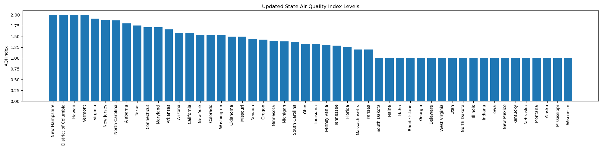
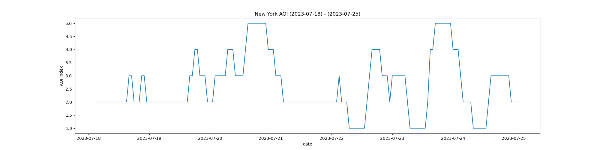
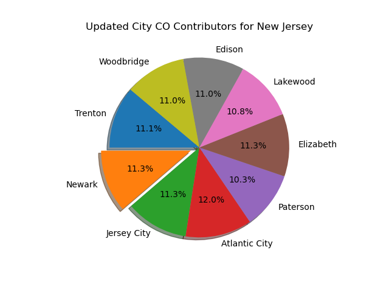
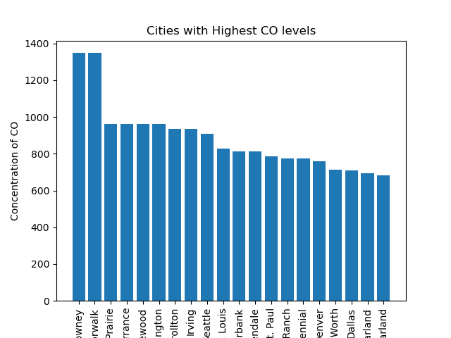
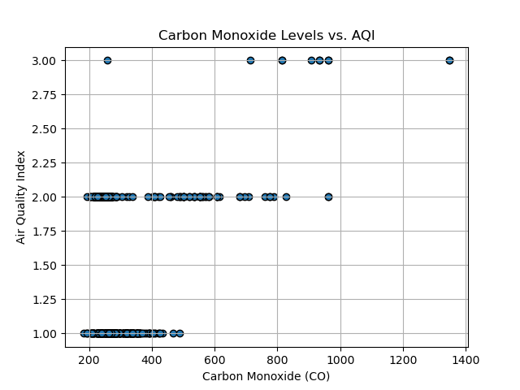
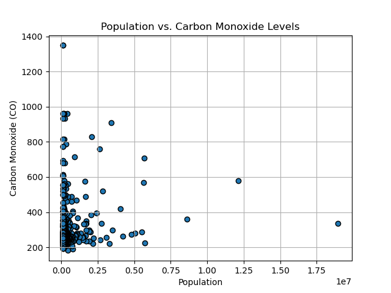
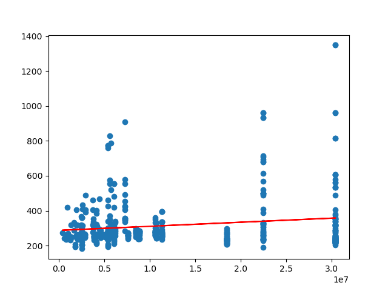
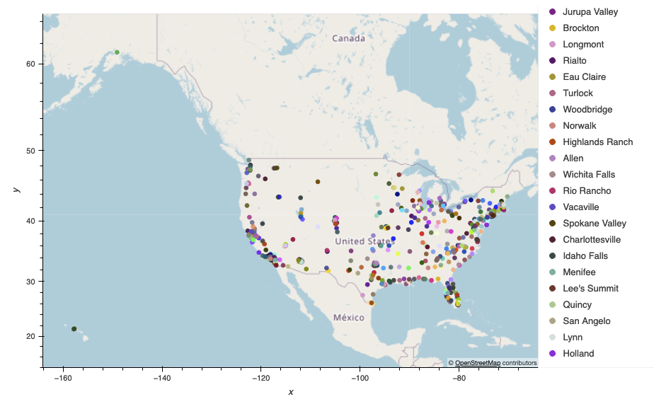
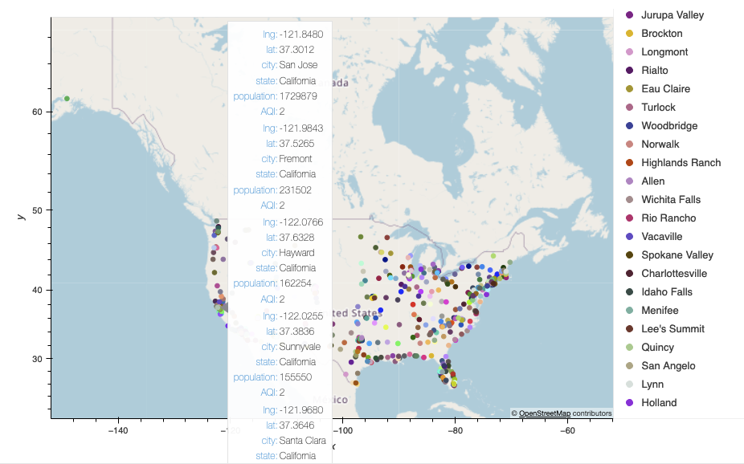

# Project 1 - Air Quality Analysis of all the states in the US 

### Team Members

-  Ashwin Jain
-  Kelvin Ramos
-  Jayashree Kotte

## Overview

Air pollution stands as the fourth primary risk factor leading to premature mortality and holds the position of the primary environmental cause of death on a global scale, contributing to over 7 million (which amounts to 1 out of 8) deaths, as per estimations by the World Health Organization. Almost 99% of the global population is exposed to contaminated air, reducing life expectancy by an average of 2.2 years worldwide.

The objective of this project revolves around examining real-time air quality data across all the states in the United States to determine the states with the most favorable and unfavorable air quality conditions. We aim to conduct a deeper analysis of air quality within these identified states, aiming to uncover any discernible patterns associated with seasonal variations and extract valuable insights from these observations.

## Research Questions
When conducting an analysis of Air Quality Index (AQI), various research questions can guide the investigation towards gaining comprehensive insights into air quality. Here are several potential research questions for AQI analysis:

1. Temporal Trends:

    * How does AQI vary over different timescales (daily, monthly, seasonally, yearly)?
    * Are there long-term trends in AQI, and if so, what factors might be contributing to these trends?

2. Geographical Variations:

    * What are the spatial variations in AQI across different regions, states, or cities?
    * Are there notable differences in air quality between urban and rural areas?

3. Pollutants Analysis:

    * Which pollutants contribute most significantly to higher AQI levels in specific locations?
    * How do different pollutants correlate with each other, and how do they collectively impact AQI?

4. Impact on Health and Environment:

    * What are the health impacts associated with varying AQI levels?
    * How does AQI affect vulnerable populations (e.g., children, elderly, individuals with respiratory conditions)?
    * What are the environmental implications of high or low AQI levels?

5. Seasonal Patterns and Weather Influence:

    * How do seasonal changes influence AQI levels?
    * What role does weather (temperature, humidity, wind patterns) play in affecting AQI fluctuations?
---
## Approach

To answer some of these questions, we analyzed the Air Quality Index in different States in the US and factored in various contributors.
The Air Quality Index (AQI) considers several air pollutants when calculating the overall air quality. The common pollutants that contribute to AQI calculations include:

1. Particulate Matter:

    * PM2.5: Particulate Matter with a diameter of 2.5 micrometers or smaller
    * PM10: Particulate Matter with a diameter of 10 micrometers or smaller

2. Ozone:O3
3. Nitrogen Dioxide: NO2
4. Sulfur Dioxide: SO2
5. Carbon Monoxide: CO

These pollutants are monitored because of their significant impact on air quality and their potential adverse effects on human health and the environment. The AQI is calculated based on the concentrations of these pollutants measured in the air. AQI values are categorized into different levels, ranging from good to hazardous, to provide an indication of the air quality and associated health risks to the public.

Different regions or countries may have variations in the specific pollutants considered in their AQI calculations based on local air quality standards and environmental concerns. However, the pollutants listed above are among the most commonly monitored and factored into AQI calculations worldwide.

## Visualizations

1. Temporal Trends:  
From the trends, you can observe the AQI levels changing with realtime execution of the code, as data is fetched realtime from open weather API. The below visualizations show different states and their respective AQI at a given point in time. 

*State Air Quality Index Levels*

*NY AQI for dates July 17, 2023 to July 25th, 2023*

2. Geographical Variations:  
From the below plot, it's safe to assume that different cities contribute to AQI for a given state and change depending on the time of day. AQI variations would also heavily depend on factors such as population of the city, urban or rural area etc.

*City CO Contributors for New Jersey*

*Cities with Highest CO levels*

3. Pollutants Analysis:  
Based on the following visual representations, it's clear that Carbon Monoxide levels, the state's population, and the number of registered vehicles significantly influence the Air Quality Index (AQI) of a particular state. However, concerning population, the relationship isn't strictly linear, as numerous factors come into play. These factors include population density, the ratio of people per square foot, as well as local initiatives aimed at reducing greenhouse gas emissions within the city or state.

*Carbon Monoxide Levels vs. AQI*

*Population vs. Carbon Monoxide Levels*

In this case, an R-squared value of approximately 0.078 (or 7.8%) suggests that around 7.8% of the variability in Carbon Monoxide pollution levels can be explained by changes in the number of registered vehicles.  
The correlation coefficient measures the strength and direction of the linear relationship between two variables. A value close to 1 indicates a strong positive linear relationship (as one variable increases, the other also tends to increase).
A value close to -1 indicates a strong negative linear relationship (as one variable increases, the other tends to decrease).  
The R-squared value and correlation coefficient exhibit fluctuations corresponding to different times of the day due to the dynamic nature of Air Quality Index (AQI), which undergoes changes over the course of a day. During peak hours, there's a greater likelihood for both these metrics to demonstrate higher values, signifying a robust positive linear relationship between the two variables.

*Correlation between Vehicles Registered and CO*

The following visualizations display the Air Quality Index (AQI) of different cities across the United States at the time when the code was executed.

*Map of all cities with an AQI in the US*

*Map of some cities in CA with hover details in the US*

## Summary
Analyzing the Air Quality Index (AQI) across US states involves assessing the levels of various air pollutants and their impact on overall air quality. Here's an analysis of AQI in US states and suggestions on how to improve it:

Current Scenario of AQI in US States:
* Variation Across States:

AQI levels vary significantly across different states due to various factors such as industrial activities, vehicular emissions, population density, geographical features, and weather conditions.
Urban areas and regions with heavy industrialization often exhibit higher AQI levels due to increased pollution from vehicles, factories, and other sources.

* Key Pollutants Affecting AQI:

The major contributors to high AQI levels typically include particulate matter (PM2.5 and PM10), ozone (O3), nitrogen dioxide (NO2), sulfur dioxide (SO2), and carbon monoxide (CO).
Some regions may face specific challenges, such as wildfire smoke affecting air quality in certain states during specific seasons.

* Health and Environmental Implications:

Elevated AQI levels pose health risks, particularly for vulnerable populations such as children, the elderly, and individuals with respiratory or cardiovascular conditions.
Poor air quality has adverse effects on the environment, ecosystems, and wildlife.

## Improvements
Strategies to Improve AQI in US States:

* Reducing Emissions from Vehicles:

Encourage the adoption of electric vehicles (EVs), improve public transportation, and incentivize the use of cleaner fuels to reduce vehicle emissions.
Implement stricter emissions standards and promote the use of hybrid vehicles to minimize pollutants like CO and NO2.

* Industrial Emission Controls:

Enforce regulations and incentivize industries to adopt cleaner technologies, improve energy efficiency, and implement emission control measures.
Enhance monitoring and compliance with emission standards for factories and industrial facilities.

* Promoting Clean Energy Sources:

Increase reliance on renewable energy sources like solar, wind, and hydroelectric power to reduce reliance on fossil fuels, thereby lowering pollution levels.
Support policies that encourage the transition towards cleaner energy alternatives.

* Urban Planning and Green Initiatives:

Develop green spaces, promote afforestation, and implement urban planning strategies that prioritize pedestrian-friendly environments and reduce reliance on personal vehicles.
Encourage green building practices, such as energy-efficient designs and materials, to minimize pollution from construction activities.

* Public Awareness and Participation:

Educate the public about the importance of reducing individual contributions to air pollution through lifestyle changes such as reducing energy consumption, proper waste disposal, and using eco-friendly products.
Foster community involvement in local initiatives aimed at improving air quality.

